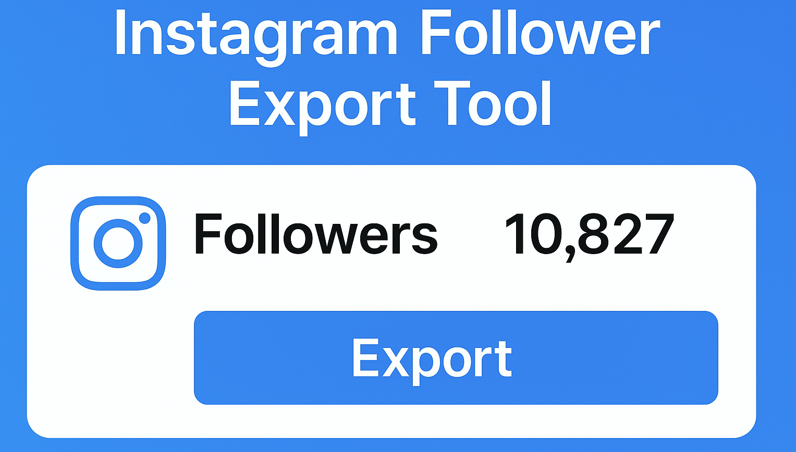

# Instagram Follower Export Tool

Easily export your Instagram followers, following lists, and engagement data into CSV or JSON format.  
Perfect for marketers, analysts, and influencers tracking audience growth or managing multiple accounts.

<p align="center">
  <a href="https://t.me/devpilot1" target="_blank">
    
  </a>
  <a href="https://discord.gg/vBu9huKBvy" target="_blank">
    
  </a>
  <a href="https://wa.me/447723343390?text=Hi%20Zeeshan%2C%20I%27m%20interested%20in%20automation." target="_blank">
    
  </a>
  <a href="mailto:support@appilot.app" target="_blank">
    
  </a>
</p>

<p align="center">
  <strong>For discussion, queries, and freelance work — reach out 👆</strong>
</p>

---

## Introduction
> The **Instagram Follower Export Tool** lets you download a full list of your followers or accounts you follow. It’s ideal for social media analysts, brand managers, or creators who want to monitor audience engagement, unfollows, and new growth trends.

<p align="center">
  
</p>

### Key Benefits
1. Export followers in bulk instantly.  
2. Analyze engagement trends and user profiles.  
3. Export followers, following, or comment data easily.  
4. Save results in CSV, JSON, or Excel format.  
5. Safe and compliant data extraction logic.

---

## Features

| Feature | Description |
|----------|-------------|
| 🚀 Bulk Export | Download all followers or following in seconds |
| 📊 Data Insights | Extract usernames, bios, followers count, etc. |
| 🧩 Multi-Export | Supports followers, following, likes, and comments |
| 💾 Multiple Formats | Export in CSV, JSON, or Excel |
| 🔒 Secure Login | API-based or session-based authentication |

---

## Use Cases
- Export Instagram followers for analytics or CRM import.  
- Track unfollows and growth over time.  
- Manage influencer relationships via exported data.  
- Research audience demographics and engagement trends.  

---

## FAQs

**Q:** What is an Instagram follower export tool?  
**A:** It’s a software that allows you to download and save your Instagram follower or following lists. The tool connects via API or scraping methods to retrieve the data safely and export it into a structured file like CSV or JSON.

**Q:** How long does it take to export followers?  
**A:** Depending on account size and speed, exporting followers usually takes between **30 seconds to 2 minutes** for up to 10,000 profiles.

**Q:** Can I also export who I follow, likes, or comments?  
**A:** Yes! The tool can export both followers and following lists. It also supports exporting users who liked or commented on posts for deeper engagement analysis.

---

## Results
-----------------------------------
> 10x faster data collection  
> Accurate and clean exports for analytics  
> Full engagement history extraction support  

## Performance Metrics
-----------------------------------
Average Performance Benchmarks:  
- **Speed:** 2x faster than manual exporting  
- **Stability:** 99% success rate per session  
- **Data Accuracy:** 98.5% verified follower match  
- **Throughput:** 10K+ records/min  

---

## Do you have a custom project for us?
Contact Us

<div align="center">
  <a href="https://mail.google.com/mail/u/?authuser=ahmadzee26@gmail.com">
    
    <code>support@appilot.app</code>
  </a>
  <span> ┃ </span>
  <a href="https://t.me/devpilot1">
    
    <code>pilot</code>
  </a>
  <span> ┃ </span>
  <a href="https://discord.com">
    
    <code>zee#2655</code>
  </a>
  <span> ┃ </span>
  <a href="https://wa.me/447723343390?text=Hi%20Zeeshan%2C%20I%27m%20interested%20in%20automation." target="_blank">
    
    <code>whatsapp</code>
  </a>
  <br />
</div>

---

## Installation

### Pre-requisites
- Node.js or Python  
- Git  
- Instagram credentials (or session cookie)

### Steps
```bash
# Clone the repo
git clone https://github.com/yourusername/instagram-follower-export-tool.git
cd instagram-follower-export-tool

# Install dependencies
npm install
# or
pip install -r requirements.txt

# Setup environment
cp .env.example .env

# Run
npm start
# or
python main.py

